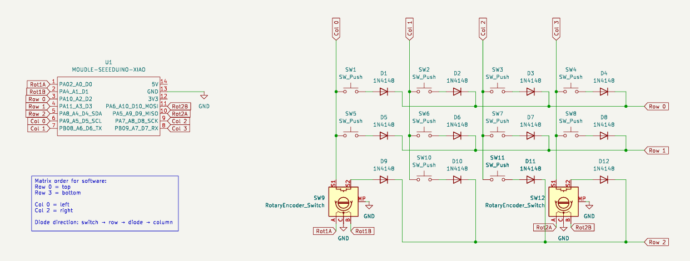
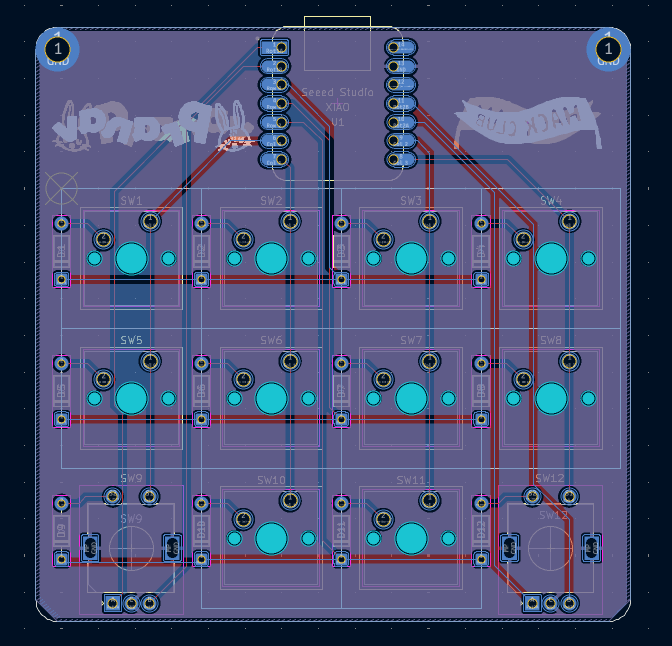
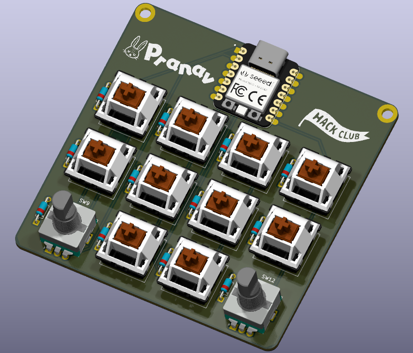
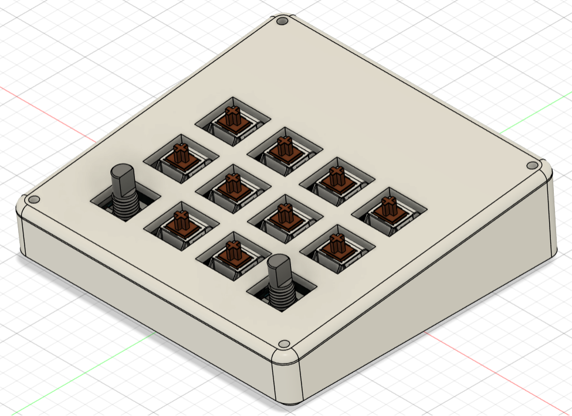
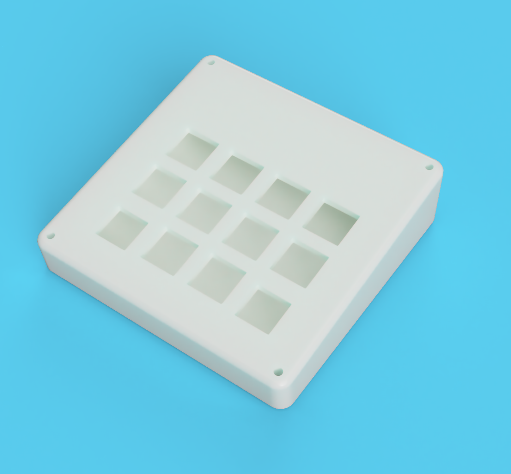
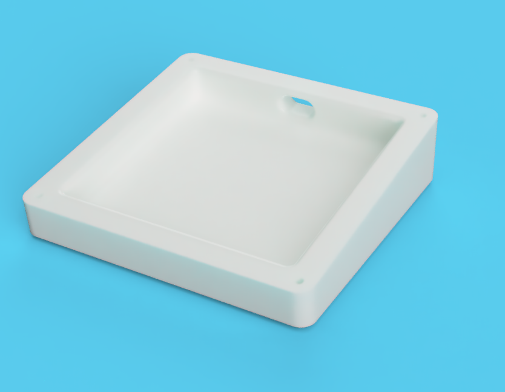
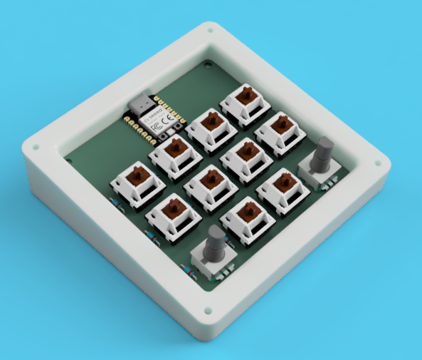

# PIVOT 12
PIVOT 12 is a macropad with 10 MX switches and two rotary encoders and uses QMK firmware. It is aimed for productivity with a huge focus on the two dials. The name "PIVOT" signifies the rotary encoders as "pivotal" control elements (*pun intended*). The "12" in the name refers to the total number of inputs (10 switches + 2 rotary encoders) on the macropad.

A lot of what I do involves switching tabs, scrolling, navigating files, adjusting volume, and triggering similar shortcuts. Instead of just keys, I wanted something that felt like a control panel, and that is where the two dials come in. One usually handles navigation (like horizontal scrolling or tab switching), and the other handles adjustments (volume, zoom, etc.). Each encoder also has a push button, so they're more than just scroll wheels.

Building this was a great learning experience. I designed the PCB in KiCad and the case in Fusion 360. It was my first time designing a PCB, and I definitely struggled, and learned a lot. The case design was also a fun challenge, especially with the incline and making sure everything fit properly and was compatible with the PCB.

# Features
* 10 MX switches
* 2 Rotary Encoders
* Case with a 7° incline for ergonomic use

# PCB
*Made in KiCad*

# CAD Model
*Made in Fusion 360*
I didn't want a flat box, so I added a 7° incline. It's subtle, but it makes a noticeable difference when using it for long periods. The incline feels natural without making the device bulky.

For a video, see https://github.com/bunnypranav/pivot12Submission/raw/refs/heads/main/images/caseVid.mp4

# BOM:
* 1x XIAO RP2040
* 10x Cherry MX Switches
* 10x DSA Keycaps
* 2x EC11 Rotary Encoder
* 12x 1N4148 DO-35 Diodes.
* 4x M3x5x4 Heatset inserts
* 4x M3x16mm SHCS Bolts
* 1x PCB: Costs about USD 14 with shipping
* 1x Case (4 printed parts)
  * Bottom base
  * Top plate
  * 2x Knurled knobs for dials